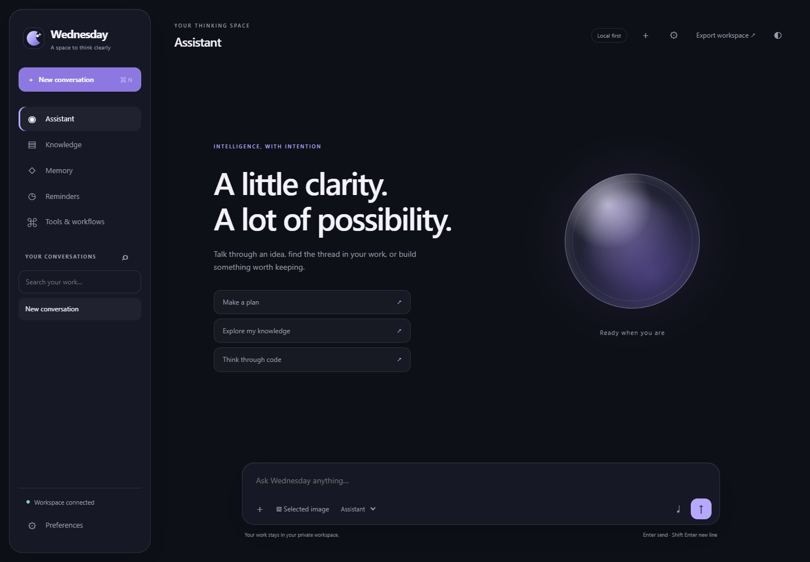

# Wednesday · JarvisAI · AuraScript

A private thinking and coding workspace with three maintained clients: a responsive browser assistant, a .NET 10 WPF Windows application, and an Electron editor with offline Monaco. Original silver/violet branding, pearl/graphite/system appearances, adaptive navigation, and restrained motion replace the earlier scaffold interfaces.



## Run locally

Use Python 3.11 for optional ML engines; the core service is also verified on Python 3.12. Create a virtual environment and install `backend/requirements-core.txt`:

```powershell
py -3.11 -m venv .venv
.venv\Scripts\python -m pip install -r backend\requirements-core.txt
if (-not (Test-Path backend\.env)) { Copy-Item backend\.env.example backend\.env }
.venv\Scripts\python -m uvicorn app.main:app --app-dir backend --host 127.0.0.1 --port 8000
```

Open [Wednesday](http://127.0.0.1:8000/ui/). Sessions, messages, documents, memories, reminders, workflows, preferences and receipts persist in an owned SQLite WAL workspace. Each client retains its own private session; copying a client session credential is the explicit way to restore that identity. Back up `data/workspace.db` using SQLite's backup API before upgrades; do not delete existing data.

For local AI, run Ollama and install the model named in `OLLAMA_MODEL`. Provider status appears in Preferences. Optional Groq/OpenAI/Gemini keys belong in the ignored `backend/.env`. Without an engine, the interface displays the actual unavailable result. It does not manufacture responses. [Engine setup](docs/SETUP.md) explains speech, image and wake-word requirements.

Windows assistant:

```powershell
dotnet run --project desktop\JarvisAI.csproj
```

AuraScript, with Node.js 22.12 or newer:

```powershell
cd aurascript
npm ci
npm run prepare:editor
npm start
```

The editor bundles Monaco and language workers from locked dependencies. File operations reject paths and links outside the selected project. Git actions require the repository root. Terminal commands execute only after explicit user submission in the local application. Selected code context is cleared when its selection closes or the workspace changes.

## Capabilities and evidence

The [20-capability matrix](docs/CAPABILITIES.md) records implementation, acceptance evidence, provider requirements, and remaining live/device checks. The [manual testing guide](docs/MANUAL-TESTING.md) gives startup commands, actual UI paths and expected results for all twenty capabilities. See [architecture](docs/ARCHITECTURE.md), [realtime contract](docs/PROTOCOL.md), and [release validation](docs/RELEASE.md).

Core automated acceptance covers owned persistence, conversation isolation, cancellation, ordered audio, source references, timezone conversion/DST gaps, selected-image cancellation, upload boundaries, real file saving, Python diagnostics, terminal processes, Git commits/diffs, workflows, exports, themes and mobile layouts. Provider contracts and ordered speech tests use explicit fixtures; live model inference, microphone hardware, optional ONNX/Whisper/Coqui engines and cross-platform installers require their own configured environments.

## Release

```powershell
cd aurascript
npm run build:win
```

The NSIS package is generated under `aurascript/dist`. [Package-Windows.ps1](scripts/Package-Windows.ps1) publishes a self-contained WPF client and a backend/source bundle with no real environment file, user data, model cache, or provider credentials. Windows packages are unsigned unless a signing identity is configured. macOS/Linux packaging is defined but has not been executed on this Windows host.

Hosted browser demonstrations must use `DEMO_MODE=true`, HTTPS, an exact allowed origin, private storage and server-side provider credentials. Demo mode blocks local microphone listeners and host launches. The hosted browser has no Electron IPC bridge and cannot run terminal processes or read host files. [Container deployment](deploy/compose.yaml) provides a bounded local showcase service; private desktop operation remains the complete local workflow.

The former scaffold installers now use maintained source and never overwrite the UI. Experimental legacy modules are not routed by the flagship service; old automatic screenshots, global histories and generated editor runtimes are superseded.
