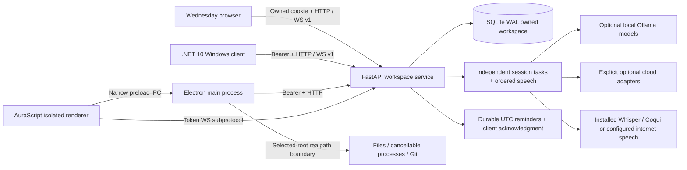

# Architecture

The desktop-first workspace uses SQLite rather than requiring a database daemon on each machine. Every query binds an authenticated owner. HTTP access requires an opaque session credential whose SHA-256 hash is stored in the database. Browser credentials use HttpOnly/SameSite cookies. Native clients hold their own local session file; the Electron renderer receives only its scoped token for the socket handshake.

WebSocket receive loops remain independent of generation. Each connection has an active cancellable task, a unique session, a conversation and a turn. Speech synthesis serializes sentences; clients suppress queued audio for interrupted turns. Control notifications are outside turn cancellation. A provider failure is an error event, not a successful assistant answer. Successful and interrupted text is persisted; reconnect loads the saved conversation.

Source retrieval is local lexical matching with excerpt offsets and source IDs. It is intentionally labeled lexical retrieval: this release does not claim an embedding/vector engine. Data records and uploaded content remain owned; retrieval does not mix users. Reference text is treated as data in prompts. Selected editor context resets when no file is selected, on workspace changes, and on a new conversation.

The hosted service exposes only deliberate bounded tools. `DEMO_MODE` blocks host launches and wake-word microphone access. The browser has no filesystem or terminal bridge. Local AuraScript main-process IPC validates the sender/frame and selected project boundary. All links are resolved before file access; a new file uses exclusive creation. Saves replace files atomically. Git requires the selected root to be the repository root. Terminal output streams from asynchronous processes with explicit cancellation.

Optional modules are loaded only when selected. The core installation runs without Torch, Whisper, Coqui, wake-word drivers, Ollama SDKs or paid keys. Existing experimental legacy modules remain unrouted. Schema creation is additive and preserves existing flagship records; export and SQLite backup provide recovery paths.

Original vector masters: `ui/assets/wednesday.svg` and `aurascript/src/assets/aurascript.svg`. Raster platform exports live under `desktop/Assets` and `aurascript/assets`. Semantic material, text, spacing, radius and motion rules are implemented in CSS/XAML; glass is concentrated in navigation, toolbars, sheets and controls so content remains readable.
